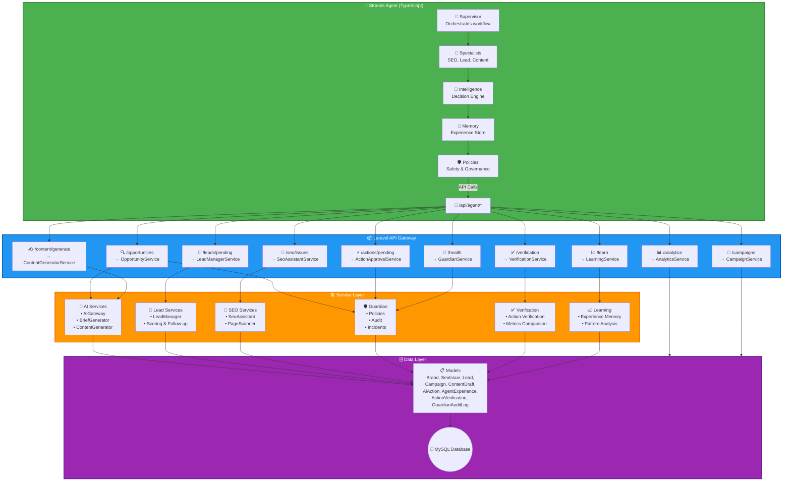

# 🧩 Vumbi API – Marketing Operations Platform

[](https://opensource.org/licenses/MIT)
[](https://laravel.com)
[](https://php.net)
[](https://agentsforhumans.devpost.com)

> **The business operating system and API backend for Vumbi AI – a complete marketing intelligence platform.**

This Laravel application provides the data models, business services, and API endpoints that power the [Vumbi AI Agent](https://github.com/Dante-VIQ/strands-agent). It handles brands, analytics, SEO, leads, campaigns, content, affiliate data, and governance.

---

## Table of Contents

- [Purpose](#-purpose)
- [Architecture Diagram](#-architecture-diagram-mermaid)
- [Integration with Strands Agent](#-integration-with-strands-agent)
- [Quick Start](#-quick-start)
- [Configuration](#configuration)
- [Directory Structure](#-directory-structure)
- [API Endpoints](#-api-endpoints)
- [Key Models](#-key-models)
- [Testing](#-testing)
- [License & Acknowledgments](#-license--acknowledgments)

---

## 🎯 Purpose

- **Central data store** – All business data in one place
- **Business services** – AI content generation, lead management, SEO analysis
- **API gateway** – Secure endpoints for the autonomous agent
- **Governance** – Guardian audit logging, policies, and incident management
- **Human control plane** – UI for monitoring and approving agent actions

---

## 🏗️ Architecture Diagram (Mermaid)

```mermaid
flowchart TD

subgraph group_presentation["Presentation"]
  node_web_ui["Livewire Control Plane"]
  node_api_gateway["Agent API Gateway"]
  node_lead_api["Lead Intake API"]
  node_routes["HTTP Routes<br/>[api.php]"]
end

subgraph group_domain["Marketing Services"]
  node_lead_service["Lead Management"]
  node_seo_service["SEO Analysis"]
  node_scanner["Page Scanner"]
  node_analytics["Analytics Collection"]
  node_campaigns["Campaign Management"]
  node_content_manager["Draft Management"]
  node_content_generator["Content Generation"]
  node_brand_context["Brand Context"]
end

subgraph group_governance["Governance Automation"]
  node_guardian["Guardian Governance"]
  node_approval["Action Approval"]
  node_scheduler["Task Scheduler"]
  node_jobs["Queued Jobs"]
end

subgraph group_data["Data Layer"]
  node_models["Marketing Models"]
end

subgraph group_integrations["External Integrations"]
  node_ai_gateway["AI Gateway"]
  node_ahrefs_service["Ahrefs Connector<br/>[AhrefsService.php]"]
end

node_human(("Marketing User"))
node_strands(("Strands Agent"))
node_gemini{{"Google Gemini"}}
node_ahrefs{{"Ahrefs API"}}
node_ga4{{"Google Analytics"}}
node_mysql[("MySQL Database")]

node_human -->|"uses"| node_web_ui
node_strands -->|"calls"| node_routes
node_routes -->|"dispatches"| node_api_gateway
node_routes -->|"dispatches"| node_lead_api
node_web_ui -->|"manages drafts"| node_content_manager
node_web_ui -->|"configures brands"| node_brand_context
node_lead_api -->|"creates lead"| node_lead_service
node_api_gateway -->|"reads leads"| node_lead_service
node_api_gateway -->|"reads SEO"| node_seo_service
node_api_gateway -->|"reads analytics"| node_analytics
node_api_gateway -->|"manages actions"| node_approval
node_api_gateway -->|"checks health"| node_guardian
node_api_gateway -->|"dispatches jobs"| node_jobs
node_lead_service -->|"qualifies leads"| node_ai_gateway
node_content_manager -->|"regenerates drafts"| node_content_generator
node_content_manager -->|"updates drafts"| node_models
node_content_generator -->|"generates content"| node_ai_gateway
node_seo_service -->|"requests SEO data"| node_ahrefs_service
node_analytics -.->|"collects metrics"| node_ga4
node_ahrefs_service -.->|"fetches data"| node_ahrefs
node_ai_gateway -.->|"generates text"| node_gemini
node_scheduler -->|"dispatches tasks"| node_jobs
node_scheduler -->|"runs follow-ups"| node_lead_service
node_jobs -->|"runs scans"| node_scanner
node_jobs -->|"collects analytics"| node_analytics
node_jobs -->|"generates drafts"| node_content_generator
node_campaigns -->|"stores recommendations"| node_models
node_guardian -->|"records governance"| node_models
node_approval -->|"updates actions"| node_models
node_lead_service -->|"stores leads"| node_models
node_seo_service -->|"stores issues"| node_models
node_analytics -->|"stores snapshots"| node_models
node_scanner -->|"stores snapshots"| node_models
node_brand_context -->|"reads brands"| node_models
node_models -->|"persists data"| node_mysql

click node_web_ui "https://github.com/dante-viq/marketting-app/tree/main/resources/views/components"
click node_api_gateway "https://github.com/dante-viq/marketting-app/blob/main/app/Http/Controllers/AgentController.php"
click node_lead_api "https://github.com/dante-viq/marketting-app/blob/main/app/Http/Controllers/Api/TravelLeadController.php"
click node_lead_service "https://github.com/dante-viq/marketting-app/blob/main/app/Services/Lead/LeadManagerService.php"
click node_seo_service "https://github.com/dante-viq/marketting-app/blob/main/app/Services/AI/SeoAssistantService.php"
click node_scanner "https://github.com/dante-viq/marketting-app/blob/main/app/Services/Scanner/PageScannerService.php"
click node_analytics "https://github.com/dante-viq/marketting-app/blob/main/app/Services/Analytics/AnalyticsCollectorService.php"
click node_campaigns "https://github.com/dante-viq/marketting-app/blob/main/app/Services/Campaign/CampaignManagerService.php"
click node_content_manager "https://github.com/dante-viq/marketting-app/blob/main/app/Services/Content/ContentDraftManagerService.php"
click node_content_generator "https://github.com/dante-viq/marketting-app/blob/main/app/Services/AI/ContentGeneratorService.php"
click node_ai_gateway "https://github.com/dante-viq/marketting-app/blob/main/app/Services/AI/AiGatewayService.php"
click node_ahrefs_service "https://github.com/dante-viq/marketting-app/blob/main/app/Services/Ahrefs/AhrefsService.php"
click node_guardian "https://github.com/dante-viq/marketting-app/blob/main/app/Services/Guardian/GuardianService.php"
click node_approval "https://github.com/dante-viq/marketting-app/blob/main/app/Services/AI/ActionApprovalService.php"
click node_scheduler "https://github.com/dante-viq/marketting-app/blob/main/app/Services/Schedule/ScheduleTaskManagerService.php"
click node_jobs "https://github.com/dante-viq/marketting-app/tree/main/app/Jobs"
click node_brand_context "https://github.com/dante-viq/marketting-app/blob/main/app/Services/BrandContextService.php"
click node_models "https://github.com/dante-viq/marketting-app/tree/main/app/Models"
click node_routes "https://github.com/dante-viq/marketting-app/blob/main/routes/api.php"

classDef toneNeutral fill:#f8fafc,stroke:#334155,stroke-width:1.5px,color:#0f172a
classDef toneBlue fill:#dbeafe,stroke:#2563eb,stroke-width:1.5px,color:#172554
classDef toneAmber fill:#fef3c7,stroke:#d97706,stroke-width:1.5px,color:#78350f
classDef toneMint fill:#dcfce7,stroke:#16a34a,stroke-width:1.5px,color:#14532d
classDef toneRose fill:#ffe4e6,stroke:#e11d48,stroke-width:1.5px,color:#881337
classDef toneIndigo fill:#e0e7ff,stroke:#4f46e5,stroke-width:1.5px,color:#312e81
classDef toneTeal fill:#ccfbf1,stroke:#0f766e,stroke-width:1.5px,color:#134e4a
class node_web_ui,node_api_gateway,node_lead_api,node_routes,node_human toneBlue
class node_lead_service,node_seo_service,node_scanner,node_analytics,node_campaigns,node_content_manager,node_content_generator,node_brand_context,node_mysql toneAmber
class node_guardian,node_approval,node_scheduler,node_jobs,node_ahrefs toneMint
class node_models toneRose
class node_ai_gateway,node_ahrefs_service,node_strands,node_gemini,node_ga4 toneIndigo
```



---

## 🔄 Integration with Strands Agent



---

## 🚀 Quick Start

### Prerequisites

- PHP 8.3+
- Composer
- MySQL 8.0+
- Node.js (for asset compilation)
- Google Gemini API key
- Optional: Ahrefs API key

### 1. Clone the Repository

```bash
git clone https://github.com/Dante-VIQ/marketting-app.git
cd marketting-app
```

### 2. Install Dependencies

```bash
composer install
npm install && npm run build
```

### 3. Configure Environment

```bash
cp .env.example .env
php artisan key:generate
```

Edit `.env`:

```env
APP_NAME="Vumbi Marketing Platform"
APP_URL=http://localhost:8000

DB_CONNECTION=mysql
DB_HOST=127.0.0.1
DB_PORT=3306
DB_DATABASE=vumbi
DB_USERNAME=root
DB_PASSWORD=

# Agent Authentication
AGENT_API_KEY=your_agent_api_key_here

# AI Services
GEMINI_API_KEY=your_gemini_key_here

# Ahrefs (optional)
AHREFS_API_KEY=your_ahrefs_key
```

### 4. Run Migrations & Seeders

```bash
php artisan migrate
php artisan db:seed --class=BrandSeeder
```

### 5. Start the Server

```bash
php artisan serve
```

Or bind to a specific host/port:

```bash
php artisan serve --host=127.0.0.1 --port=8000
```

---

## 📁 Directory Structure

```text
app/
├── Http/
│   ├── Controllers/
│   │   ├── AgentController.php      # Agent API endpoints
│   │   ├── BriefController.php      # AI Brief UI
│   │   ├── ActionController.php     # Action management
│   │   ├── SeoController.php        # SEO management
│   │   ├── GuardianController.php   # Governance UI
│   │   └── Api/
│   │       └── TravelLeadController.php
│   └── Middleware/
│       └── VerifyApiKey.php         # Agent authentication
├── Models/
│   ├── Brand.php                    # Tenant/brand management
│   ├── AnalyticsSnapshot.php        # Analytics data
│   ├── SeoIssue.php                 # SEO issues
│   ├── Lead.php                     # Lead management
│   ├── Campaign.php                 # Campaign tracking
│   ├── ContentDraft.php             # Generated content
│   ├── AiAction.php                 # AI action queue
│   ├── AgentExperience.php          # Agent learning memory
│   ├── ActionVerification.php       # Action verification
│   ├── GuardianAuditLog.php         # Audit trail
│   ├── GuardianPolicy.php           # Governance policies
│   └── KnowledgeBase.php            # Business knowledge
├── Services/
│   ├── AI/
│   │   ├── AiGatewayService.php     # Gemini AI integration
│   │   ├── BriefGeneratorService.php # AI brief generation
│   │   ├── ContentGeneratorService.php # Content generation
│   │   ├── SeoAssistantService.php  # SEO analysis
│   │   └── ActionApprovalService.php # Action approval
│   ├── Lead/
│   │   └── LeadManagerService.php   # Lead management
│   ├── Scanner/
│   │   └── PageScannerService.php   # Page scanning
│   ├── Analytics/
│   │   └── AnalyticsCollectorService.php # Analytics collection
│   ├── Campaign/
│   │   └── CampaignManagerService.php # Campaign management
│   ├── Content/
│   │   └── ContentDraftManagerService.php # Draft management
│   ├── Guardian/
│   │   └── GuardianService.php      # Governance
│   ├── Schedule/
│   │   └── ScheduleTaskManagerService.php # Scheduling
│   ├── Ahrefs/
│   │   └── AhrefsService.php        # Ahrefs connector
│   └── BrandContextService.php      # Brand context
└── Jobs/                            # Queued jobs
routes/
├── api.php                          # API routes
└── web.php                          # UI routes
database/
└── migrations/                      # Database migrations
resources/
└── views/
    └── components/                  # Livewire/UI components
```

---

## 🔌 API Endpoints

All `/api/agent/*` endpoints require the `X-API-Key` header unless configured otherwise.

| Area          | Method | Endpoint                                   | Purpose                       |
| ------------- | -----: | ------------------------------------------ | ----------------------------- |
| Opportunities |    GET | `/api/agent/opportunities/{brandId}`       | Fetch opportunities for brand |
| Analytics     |    GET | `/api/agent/analytics/{brandId}`           | Fetch analytics snapshot      |
| SEO           |    GET | `/api/agent/seo/issues/{brandId}`          | List SEO issues               |
| SEO           |    GET | `/api/agent/seo/issue/{brandId}/{issueId}` | Get specific SEO issue        |
| SEO           |   POST | `/api/agent/seo/analyze/{brandId}/{issueId}` | Run analysis on issue       |
| Leads         |    GET | `/api/agent/leads/pending/{brandId}`       | Pending leads for brand       |
| Leads         |   POST | `/api/agent/lead/follow-up/{brandId}`      | Generate follow-up content    |
| Content       |   POST | `/api/agent/content/generate`              | Generate content draft        |
| Actions       |   POST | `/api/agent/actions/pending`               | Create pending action         |
| Scan          |   POST | `/api/agent/scan/{brandId}`                | Trigger page scan             |
| Verification  |   POST | `/api/agent/verification/start/{brandId}`  | Start verification flow       |
| Learning      |   POST | `/api/agent/learn/{brandId}`               | Record learning/example       |
| Health        |    GET | `/api/agent/ai/ping`                       | AI service health check       |

For the full list, see `routes/api.php`.

---

## 🧱 Key Models

| Model              | Purpose                                  |
| ------------------ | ---------------------------------------- |
| Brand              | Tenant / brand configuration             |
| AnalyticsSnapshot  | Daily/periodic analytics metrics         |
| SeoIssue           | Detected SEO issues and metadata         |
| Lead               | Lead records and status                  |
| Campaign           | Campaign tracking and attribution        |
| ContentDraft       | Generated content drafts and metadata    |
| AiAction           | Queued AI actions initiated by the agent |
| AgentExperience    | Agent learning memory and examples       |
| ActionVerification | Verification results for actions         |
| GuardianAuditLog   | Audit trail for governance events        |

---

## 🧪 Testing

Run unit and feature tests:

```bash
php artisan test
```

Quick API test:

```bash
curl -H "X-API-Key: ${AGENT_API_KEY}" http://localhost:8000/api/agent/analytics/1
```

---

## 📄 License & Acknowledgments

This project is licensed under the MIT License.

Thanks to Laravel, Google Gemini, and the Strands Agents SDK for the integrations and inspiration.